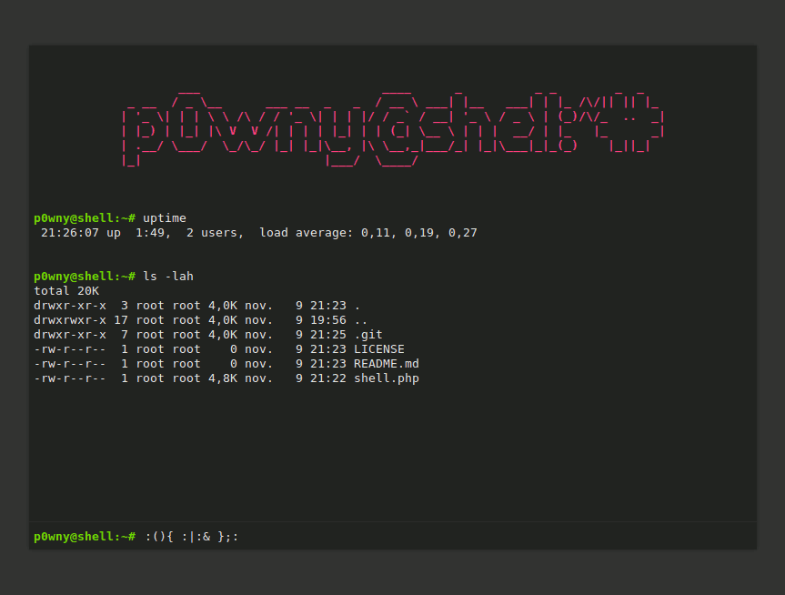

# p0wny@shell:~# -- Single-file PHP Shell

p0wny@shell:~# is a very basic, single-file, PHP shell. It can be used to quickly execute commands on a server when pentesting a PHP application. Use it with caution: this script represents a security risk for the server.

**Features:**

* Command history (using arrow keys `↑` `↓`)
* Auto-completion of command and file names (using `Tab` key)
* Navigate on the remote file-system (using `cd` command)
* Upload a file to the server (using `upload <destination_file_name>` command)
* Download a file from the server (using `download <file_name>` command)

**WARNING:** THIS SCRIPT IS A SECURITY HOLE. **DO NOT** UPLOAD IT ON A SERVER UNLESS YOU KNOW WHAT YOU ARE DOING!

**Demo with Docker:**

        docker build -t p0wny .
        docker run -it -p 8080:80 -d p0wny
        # open with your browser http://127.0.0.1:8080/shell.php

## Contributing

### Questions

If you have any question, you can:

* [Open an issue](https://github.com/flozz/p0wny-shell/issues) on GitHub
* [Ask on Discord](https://discord.gg/P77sWhuSs4) (I am not always available to chat, but I try to answer to everyone)

### Bugs

Please [open an issue](https://github.com/flozz/p0wny-shell/issues) on GitHub with as much information as possible if you found a bug:

* Your operating system / Linux distribution (and its version)
* The PHP version you are using (example: `PHP-FPM 8.1`, `Apache mod_php 7.4`,...)
* The Web server you are using and its version (example: `Nginx 1.23`, `Apache 2.4.55`,...)
* All the logs and message outputted by the software
* etc.

### Pull requests

Please consider [filing a bug](https://github.com/flozz/p0wny-shell/issues) before starting to work on a new feature; it will allow us to discuss the best way to do it. It is obviously unnecessary if you just want to fix a typo or small errors in the code.

## Support this project

Want to support this project?

* [☕️ Buy me a coffee](https://www.buymeacoffee.com/flozz)
* [💵️ Give me a tip on PayPal](https://www.paypal.me/0xflozz)
* [❤️ Sponsor me on GitHub](https://github.com/sponsors/flozz)

## Changelog

* **v2023.08.10:**
  * Make p0wny@shell compatible with PHP 5.3 (@FrancoisCapon, #38)
* **v2023.05.28:**
  * Encode all data fields as base64 to avoid encoding errors, especially on Windows (@cli-ish, #8, #35)
* **v2023.05.22:**
  * Display the username and the hostname in the prompt (@cli-ish, #33, #7)
* **v2023.05.10:**
  * Try different execution functions (`exec`, `shell_exec`, `system`, `passthru`, `popen`, `proc_open`) to run commands to bypass disabled functions (@cli-ish, #31, #32)
* **v2023.02.27:**
  * Make terminal window resizable (@FrancoisCapon, #27)
* **v2023.02.13:**
  * Larger terminal size on large screens (@psyray, #26)
  * No more horozontal scrolling on small screens (@flozz)
* **v2022.09.19:**
  * Expand path in `cd` command (`cd ~`, `cd ~username`,...)
  * Go home when running cd withoud argument.
  * → Thanks @FrancoisCapon for the suggestion (#25)
* **v2021.01.24:**
  * Style improvements:
    * Better-looking scrollbar on webkit (@nakamuraos)
    * Display a smaller logo on mobile (@nakamuraos)
  * Ergonomic improvements:
    * Focus the command field when clicking the page (@nakamuraos)
    * Put the cursor at the end of the command field while navigating the history (@nakamuraos)
* **v2019.06.07:**
  * Adds the `clear` command to clear the terminal (@izharaazmi #12)
* **v2018.12.15:**
  * File upload and download feature (@Oshawk #5)
* **v2018.06.01:**
  * Auto-completion of command and file names (@lo001 #2)
  * Adaptation to mobile devices (responsive) (@lo001 #2)
  * Improved handling of stderr (@lo001 #2)
* **v2018.05.30:**
  * ES5 compatibility (@lo00l #1)
  * Dependency to JQuery removed (@lo00l #1)
  * Command history using arrow keys (@lo00l #1)
  * Keep the command field focused when pressing the tab key
* **v2017.10.30:**
  * CSS: invalid color fixed
* **v2016.11.10:**
  * Initial release
